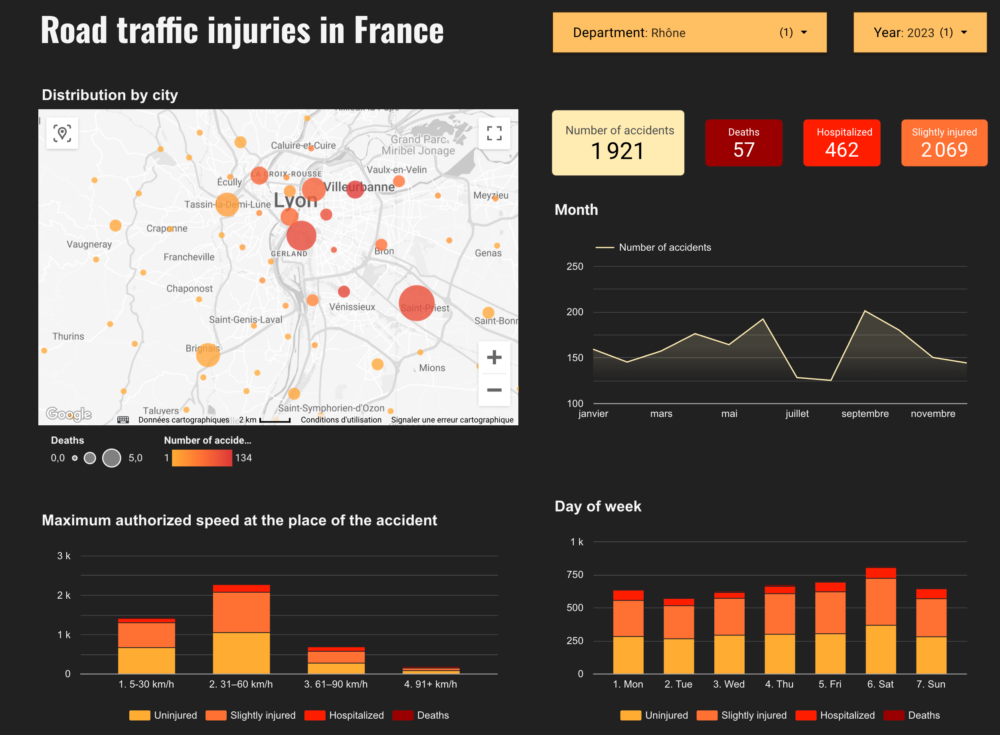
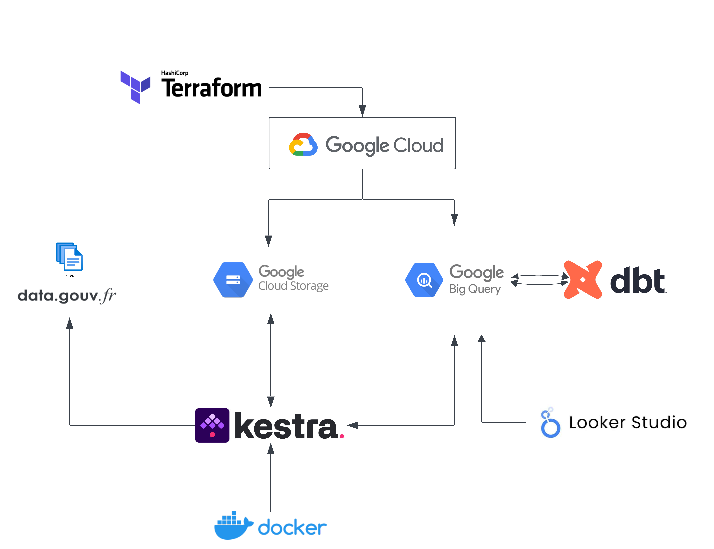
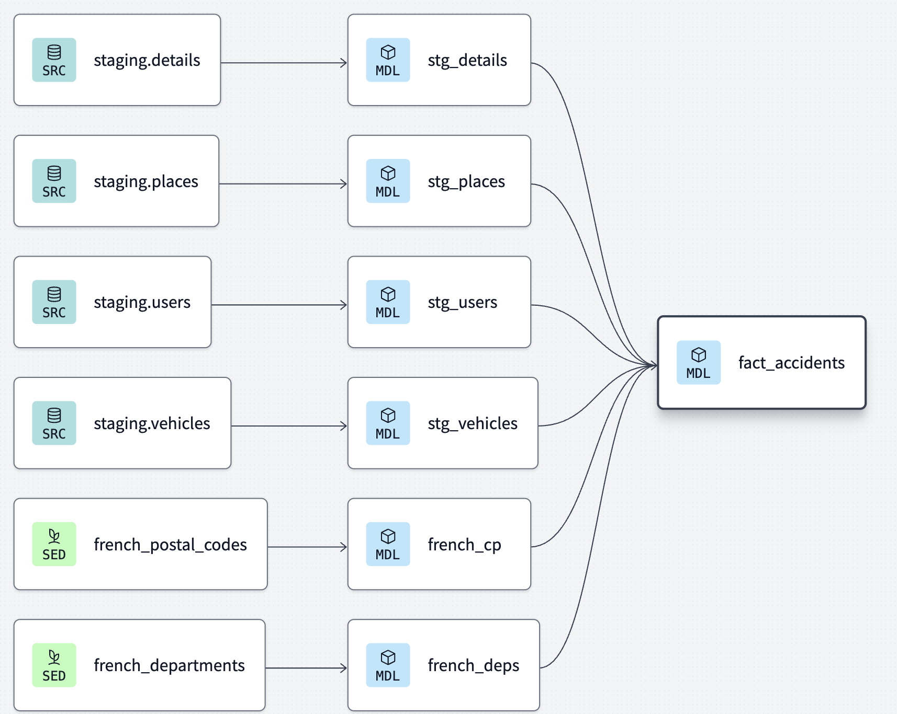

# Road traffic injuries in France 🚘 🤕 🚑

## Project description

Road accidents are a major public safety concern, causing injuries, fatalities, and significant economic losses. This project aims to analyze **annual datasets of traffic accidents in France**, sourced from [data.gouv.fr](https://www.data.gouv.fr/fr/datasets/bases-de-donnees-annuelles-des-accidents-corporels-de-la-circulation-routiere-annees-de-2005-a-2023/). By leveraging data engineering tools, we will process, clean, and integrate these datasets to uncover key insights, such as accident hotspots, trends over time, and the impact of factors like speed limits, day of the week and season.

*Disclaimer*: This analysis focuses on data from 2021 to 2023, as earlier datasets have a different CSV format that would require additional adaptations.

## Preview

  

[Link to the dashboard](https://lookerstudio.google.com/reporting/dc3527bf-b243-4f80-9981-8671b1b15bf2)

## Technologies Used

- **Infrastructure as Code (IaC)**: Terraform
- **Cloud Platform**: GCP (Google Cloud Platform)
- **Data Lake**: GCS Bucket
- **Data Warehouse**: BigQuery
- **Data Transformation**: dbt
- **Dashboard Tool**: Looker Studio
- **Containerization**: Docker
- **Workflow Orchestration**: Kestra

## Data pipeline

  

The basic data are retrieved from **data.gouv.fr**. They include 4 csv files for each year:

- `details` (*caractéristiques* in french)
- `users` (*usagers* in french)
- `vehicles` (*véhicules* in french)
- `places` (*lieux* in french)

**Kestra** creates four main BigQuery tables (`details.sql`, `users.sql`, `vehicles.sql`, `places.sql`) and 4 related staging tables. Staging tables are used to ensure data consistency and allow incremental updates before merging with the main tables.

Each csv file from data.gouv.fr is uploaded by Kestra to a Google Cloud bucket. It is then transformed into a BigQuery staging table. The staging table is then merged with the main table, and truncated.

  

Then, with **dbt**, we perform a number of clean-ups and improvements:

- keep only data from metropolitan France
- rework the format of dates and identifier fields
- create an actual geospatial POINT field,
- transform key values into meaningful names via macros (`gravity_description`, `gender_description` etc).

We also add 2 *seeds*, still supplied by data.gouv.fr:

- `french_departments.csv`: mapping between the codes and the names of the French departments
- `french_postal_codes.csv`: mapping between the INSEE code of a municipality and its name

Finally, we create a **`fact_accidents.sql`** table which aggregates the data for a given accident as follows:

- number of users involved
- number of users by severity of injury (four categories: `uninjured`, `slightly injured`, `hospitalized` and `killed`)
- number of vehicles involved
- city name
- department name
- maximum speed at accident location

## Running the project

[Installation and Setup](/docs/installation.md)

## Possible Improvements

- Older datasets (2005–2020) follow a slightly different schema, which requires custom parsing and mapping to align with the current data model.

## Acknowledgements

This project was completed as part of [Data Engineering Zoomcamp](https://github.com/DataTalksClub/data-engineering-zoomcamp) - a free course organized by the [DataTalks.Club community](https://datatalks.club/).
